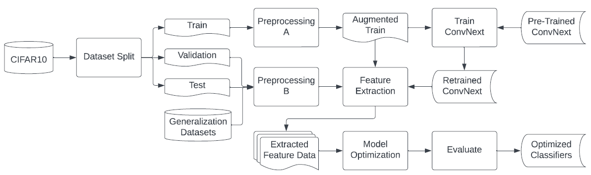

# Image classification on Cifar-10 using ConvNeXt

(The Documentation is not yet complete.)

### Technologies Used:

PyTorch, TensorFlow, ConvNeXt, Feature Extraction, SVM, Logistic Regression, Feed Forward
Neural Networks, CNN, Bayesian Optimization

### Summary:
• Classified Images in the Cifar-10 dataset using state-of-the-art technologies,
namely ConvNeXt as a model and feature extractor.

• Modified the Architecture of the ConvNeXt model and retrained the
modified layers. Compared seven different machine learning models and
chose the top 3 (SVM, Feed Forward, Logistic Regression) for further
improvements. Utilized Bayesian optimization for the models.

• Attained 97.61 percent accuracy on the test set. External images were
also fed to the model from different sources to cross-examine the results
as a generalization set. 88.68 percent accuracy was recorded for
the generalization set.

## Abstract

This Project goes over the process of training ConvNeXt model on CIFAR-10 as well as utilizing transfer learning and feature extraction in conjunction with Neural networks, SVM and Logistic Regression. The machine learning models get optimized with Bayesian optimization method and compared with each other based on test and generalization sets. 

# Table of Contents
- [1. Introduction](#1-introduction)
- [2. Problem Definition and Motivation](#2-problem-definition-and-motivation)
- [3. Related Work](#3-related-work)
  - [3.1 Image Augmentation and Transfer Learning](#31-image-augmentation-and-transfer-learning)
  - [3.2 Logistic Regression](#32-logistic-regression)
  - [3.3 Support Vector Machine](#33-support-vector-machine)
  - [3.4 Neural Networks](#34-neural-networks)
- [4. Methodology](#4-methodology)
  - [4.1 Datasets](#41-datasets)
  - [4.2 Preprocessing](#42-preprocessing)
  - [4.3 Model Selection](#43-model-selection)
  - [4.4 ConvNeXt Architecture](#44-convnext-architecture)
  - [4.5 Transfer Learning](#45-transfer-learning)
  - [4.6 ConvNeXt & Transfer Learning](#46-convnext--transfer-learning)
  - [4.7 Retrained ConvNeXt](#47-retrained-convnext)
  - [4.8 Feature Extraction](#48-feature-extraction)
  - [4.9 ConvNeXt & Feature Extraction](#49-convnext--feature-extraction)
  - [4.10 Logistic Regression (LR)](#410-logistic-regression-lr)
  - [4.11 Support Vector Machine (SVM)](#411-support-vector-machine-svm)
  - [4.12 Neural Networks](#412-neural-networks)
  - [4.13 Model Optimization](#413-model-optimization)
  - [4.14 Hyperparameters](#414-hyperparameters)
  - [4.15 Evaluation Metrics](#415-evaluation-metrics)
- [5. Results and Discussion](#5-results-and-discussion)
  - [5.1 Optimization Results](#51-optimization-results)
  - [5.2 Final Model Performance Results](#52-final-model-performance-results)
- [6. Conclusion](#6-conclusion)
- [7. References](#7-references)

# 1. Introduction

With the evolution of technology, there’s almost nothing that machines cannot perform. With proper training and modelling, they can be designed to perform image classification more effectively than humans can in a very short time. 

Our main purpose is to classify images based on the CIFAR-10 dataset. It comprises of 60000 32x32 colour images in 10 classes, with 6000 images per class-airplane, car, bird, cat, deer, dog, frog, horse, ship and truck. There are 50000 training images and 10000 test images. We make use of the SVM, Logistic Regression, Neural networks models to help implement the image classification. All these are then compared with the benchmark ConvNeXt pre-trained and re-trained machine learning models which is the base of our study as it has been found to have comparable results with the transformers, in addition to its architecture which helps amplify the model [[1]](#1).

Image classification with the use of machine learning helps replace the manual and time-consuming human intervention wherever possible to generate fast and accurate results. Classification of these images can be particularly used in the fast-evolving autonomous driving applications, identifying the specific species in a given habitat, national security applications, and most importantly medical imaging use-cases thereby serving great purposes [[2]](#2) - [[4]](#4).

# 2. Problem Definition and Motivation

The volume, velocity, and variety of data available has never been more abundant for researchers [[3]](#3) , [[5]](#5). However, innovations and improvements are still needed to streamline the use and understanding of this data. For this report, image classification is of particular interest because to benefit from the large amounts of data being collected, it needs to be processable in reasonable amounts of time. The main objective is to identify different animals like birds, cats, deer, dog, frog, horse and objects like airplane, automobiles, ship, and truck based on several parameters.

Some particular use cases for image classification include autonomous driving, wildlife conservation and medical care. As a component of autonomous driving, accurate image classification has the potential to reduce the risks associated with driving [[6]](#6). Within the domain of wildlife conservation, image classification can provide essential data for tracking and improving researchers’ understanding about wildlife diversity which is critical in monitoring the health of the ecosystem [[3]](3). Additionally, in healthcare image classification can assist with early detection of illnesses and enable physicians to react promptly with treatment plans [[4]](#4). The purpose of the models created in this report are to leverage recent improvements made with image classification techniques and demonstrate their usefulness for automated image data management.

# 3. Related Work

The papers reviewed in creating this report are divided into four sections, the first being image augmentation and transfer learning. The remaining sections are overviews of applications of SVM, logistic regression (LR), and neural network machine learning models in the domain of  image classification. 

## 3.1 Image Augmentation and Transfer Learning

A survey of work conducted in deep learning by [[7]](#7) identified common image augmentation techniques used in computer vision classification to avoid overfitting.  The three main varieties of augmentation that were identified by the authors were geometric, deep learning, and test-time augmentation. The geometric augmentations included common manipulations such as flipping,  rotating, and applying kernel filters to images. Deep learning augmentations included techniques such as adversarial training and GAN augmentation. Finally, test-time augmentation outlined methods such as curriculum learning and class imbalance.

The authors Zhuang et al. [[8]](#8) conducted a survey of transfer learning and the various categorizations applicable to adapting knowledge across different domains of machine learning applications. The two major interpretations provided by the authors [[8]](#8) are data-based interpretation, which has the objective of reducing the distribution differences between the source and target domain data, and the model-based interpretation which involves using a model trained on another domain/dataset to make predictions.
Within this report, a model-based interpretation of transfer learning is applied by implementing the ConvNeXt CNN for feature extraction from images for classification predictions.

## 3.2 Logistic Regression

Authors [[9]](#9) used the multinomial binary variant of LR for land-use land-cover classification of satellite images including water bodies, forests, sand, and barren, crop, fallow and grasslands. The authors extracted the image data in tabular format using the sample tool provided in the ArcGIS geographical services software.

Stochastic Gradient Descent Logistic Regression (SGDLR) was used by authors [[10]](#10) for identifying a failure mode of asphalt pavement by classifying road images as raveling and non-raveling. Various statistical features were extracted from the pictures for classification by SGDLR models including mean, standard deviation, skewness, kurtosis, entropy and range of the red, green and blue (RGB) colour channels.  Gray level co-occurrence matrix data was all used in classification which included angular second moment, contrast, correlation and entropy at various image angles.

## 3.3 Support Vector Machine

Hyperspectral images of asphalt, meadows, gravel, trees, painted metal sheets, bare soil, bitumen, self-block bricks and shadows  were classified using SVM with a radial basis function (RBF) by authors [[11]](#11). The feature extraction techniques used by the authors [[11]](#11) include kernel based feature extraction, the extended Hilbert-Schmidt independence criterion for minimizing the associated p-value, feature selection based on feature similarity and recursive feature elimination. 

Among other machine learning models, authors [[12]](#12) applied SVM models with the linear, polynomial and RBF kernels for the detection of diseased rice leaves. Feature extraction from the leaf images was performed using local binary pattern and histogram of oriented gradients techniques. 

The authors [[13]](#13) used deep SVM for hyperspectral image classification by configuring multiple SVM models into a neural network architecture. Within the model, SVMs with exponential radial basis function, Gaussian RBF, and polynomial kernels acted as the activation functions for the hidden layers of the deep neural network.

## 3.4 Neural Networks

Feed-Forward Neural Networks (FFNN) were also implemented by Pham et al. [[14]](#14) for early disease detection in agriculture using leaf images. The FFNN machine learning model was selected by the authors due to its relative simplicity compared to convolution neural networks (CNNs), as the aim of the paper was to develop a model that could be used on a computationally limited devices, such as smartphones, so that the model can be used by agricultural workers while operating in the field.

The ConvNeXt CNN was trained by Liu et al. [[1]](#1) on the ImageNet-1k dataset, in a collaboration between Facebook AI Research and UC Berkeley. Although Vision Transformers perform strongly in image classification, they face difficulty with generalizing to computer vision tasks due to their computational complexity for larger images. The benefit found in using the ConvNeXt model is state of the art performance with improved computational efficiency [[1]](#1).

# 4. Methodology

This section provides a general overview of the process taken to prepare images for the machine learning models, how to implement ConvNeXt for feature extraction, using Bayesian Optimization for hyperparameter tuning, and common performance metrics used to evaluate classification machine learning models. The visual representation of the methodology progression is given in Fig 1. 

## 4.1 Datasets

The CIFAR-10 dataset is split into train, validation, and testing sets. The training set is used for adjusting the machine learning model parameters to make classification predictions. The validation set is used for hold-out validation of model performance during the tuning stage in order to select the best model configuration. The test and generalization sets  are only presented to the chosen optimal models after Model Optimization to evaluate the final model performance. Once the models are evaluated on the test and generalization sets, no further tuning or model selections are made. The difference between the test and generalization sets is that the test set comes from the CIFAR-10 dataset and the generalization set is composed of images from different sources. The purpose of the generalization set is to evaluate how models perform on completely novel images outside of the CIFAR-10 dataset. 

The four sets of image data are outlined in Table I. The CIFAR-10 images are each 32x32 pixel colour images and consist of a balance of airplane, car, bird, cat, deer, frog, horse, ship and truck images. The generalization images are not uniform in size but are all colour images.  The generalization class is a combination of image datasets from  Kaggle and only contains images of the cat, dog, horse and ship classes. 

## 4.2 Preprocessing

To begin preprocessing, the z-score normalization is used to scale image pixel values, as shown in the following equation (1).

Where \(x’\) and \(x\) are the scaled and unscaled values of the \(i\)th element of the \(j\)th image colour channel respectively. The \(\mu\) and \(\sigma\) symbols are the mean and standard deviation of all the samples of the \(j\)th image channel respectively in the train set [[18]](#18). Preprocessing A applies resizing, center cropping, additional augmentation, and z-score normalization  to the train set of images. Resizing all images ensures that all pictures are the same size for model training. The purpose of the additional image augmentation is to reduce models overfitting to the images of the training set and improve the model’s ability to generalize when making predictions for novel images. Finally, normalization of the pixel values is used to prevent small or large pixel values from having disproportionate impacts on model training.

While Preprocessing B also applies resizing, center cropping and z-score normalization to the validation, test and generalization sets, it differs from Preprocessing A because it performs significantly fewer augmentations. The validation, test and generalization sets do not require the same augmentations because they are not being used for training the actual model parameters during training and so the same precautions do not need to be taken to avoid overfitting the model to them. The specifics of the augmentations performed in preprocessing are outlined in Table II.

## 4.3 Model Selection

The preliminary results of our initial model exploration can be seen on figure 2. The Figure 2 illustrates the accuracy of prediction of different models on CIFAR-10 test set. The models consist of AlexNet [[19]](#19) as a feature extractor in conjunction with LR, ConvNeXt as pre-trained, retrained and feature extractor. ConvNeXt feature extractor is used in conjunction with Neural Networks, SVM, LR, XGBoost, CatBoost, Naive Bayes. There is also one retrained version of ConvNeXt finetuned using Wandb [[20]](#20). The top three models are selected to improve further. ConvNeXt retrained \& pre-trained as stand alone models also are used as a benchmark for our work.

## 4.4 ConvNeXt Architecture

The ConvNeXt [[21]](#21) architecture is based on ResNet [[22]](#22). It is a modernized Convolutional neural network model. The modernization techniques used in ConvNeXt are mainly from Vision Transformers [[23]](#23). The foundation is a ResNet-50 that is iteratively improved in both accuracy and performance. The final result achieved a greater accuracy and performance over the ground breaking Vision Transformers model.

## 4.5 Transfer Learning

The traditional approach for machine learning is that the model A will train on the dataset A while the model B will train on the dataset B. Transfer learning [[24]](#24) is a technique in which the model A will train on dataset A then transfer its knowledge and what it has learned to the model B. The model B will now either finetune itself on dataset B or Predict dataset B straight away.

## 4.6 ConvNeXt & Transfer Learning

First, the pre-trained ConvNeXt is loaded. All the gradients of the model get locked so they won't change.  The last layer which is a fully connected network with one thousand neurons gets removed and replaced with fully connected network with 10 neurons. This is because the ImageNet-1k [[25]](#25) which ConvNeXt is trained on has 1000 classes while our dataset only has 10. This modified model will now get trained on CIFAR-10 so the last layer can train on the dataset. We call this model pre-trained ConvNeXt. The simplified structure of ConvNeXt can be seen below in figure 3.

## 4.7 Retrained ConvNeXt

The pre-trained ConvNeXt is loaded just like before but without locking the gradients.The same procedure for modifying the model is followed. The modified version this time gets retrained from the ground up on CIFAR-10. We call this model Retrained ConvNeXt.

## 4.8 Feature Extraction

Feature Extraction [[27]](#27) is the process of reducing the high dimensional, often noisy data to a low dimension more meaningful data. There are numerous benefits for this technique, some are stated below. Noise reduction, minimizing training time, improvement in model accuracy

* Noise reduction
* Boost in training speed
* Improvement in model accuracy
* Rise in model explainability
* Better data visualization

## 4.9 ConvNeXt & Feature Extraction

This project uses ConvNeXt as a feature extractor.The procedure is almost the same as making the modified model that got previously stated. This time the last layer gets completely removed without any replacement. The new last layer now has an output of 768 features. The model is fed with 224 by 224 pixel images in 3 channels of color (RGB). The model turns each image that consists of 150,528 points of data to only 768. Our new data is now ready to be fed into machine learning for training, evaluation and prediction.

## 4.10 Logistic Regression (LR)

Logistic regression [[28]](#28) is a widely used model for solving statistical and machine learning problems. This model can be applied to both binary and multiclass classification. In this project we focus on multiclass classification wherein, we train the model iteratively to minimise the Cross-Entropy Loss, trying to bring the value as close to 0 as possible.  We can use many solvers in LR however, here we focus on ‘saga’ [[29]](#29), an extension of ‘sag’ that is stochastic average gradient descent. ‘saga’ works better for large data sets and aids in using L1 and L2 cost functions.

## 4.11 Support Vector Machine (SVM)

Support Vector Machine (SVM) is a classifier that works well for intricate problems.  Support vector machine requires clear separation of classes. For example, in figure 4 we can see a hyperplane separating the classes. We are trying to maximize the margin to gain accuracy. For this project we mainly focus on the RBF kernel(Radial basis function)[[30]](#30). In RBF, we use linear combinations to approximate multivariate functions. 

## 4.12 Neural Networks

The main focus in this project are Neural Networks [[32]](#32) where connected neurons form layers. A neuron in a neural network can take input from multiple data nodes. An input and output layer is always there along with multiple hidden layers. The main parameters in this model are Weights and biases. The figure 5 represents the inner workings of Neurons in part (a) as well as fully connected layers in part (b). Several hyperparameters are accounted for here namely, the number of hidden layers and neurons, activation functions, optimizer and its learning rate, cost functions and the number of epochs. Decisions regarding whether to activate a neuron or not are done using activation functions while the optimizer is beneficial for modifying the attributes, weights, learning rate etc. 

## 4.13 Model Optimization

Training and tuning of machine learning model hyperparameters is performed using Bayesian optimization. The benefit of using Bayesian optimization over grid or random search is that after training several initial models, Bayesian optimization directs hyperparameter selection by using the performance results of trained models to create a probabilistic model for the objective function, under the assumption that the results follow a Gaussian distribution [[34]](#34). This directed approach to hyperparameter selection increases the potential of finding a combination of hyperparameters that achieve an optimum performance result for the objective function while exploring a smaller portion of the search area than grid or random search [[35]](#35). In order to have as balanced of a comparison of performance results as possible, the size of the search space and number of Bayesian optimization trials are the same for each model. The minimum number of random samples required for the Bayesian Optimization implemented in this report is given in the following equation (2).

Where \(N_{min}\) is the minimum number of random samples required and \(d\) is the number of hyperparameters being tuned [[34]](#34).  This means that Bayesian Optimization only begins after \(d+3\) random configurations have been implemented in order to provide a sufficient starting point for objective function estimation. 

Each model was given a search space of 45 possible combinations of hyperparameters which were explored over 15 trials of Bayesian optimization, meaning that a third of the search space will be explored for each model. Additionally, the 45 possible combinations of hyperparameters will be spread across three hyperparameters for each model. This means that six randomized models will be created to initialize the objective function, with the goal of the objective function being to  maximize the accuracy on the train set.

## 4.14 Hyperparameters

The hyperparameters that are tuned for SVM include the regularization, gamma and tolerance parameters. The regularization value for SVM determines the size of the impact of the penalty for a boundary that misclassifies an image. The larger the regularization value, the smaller the penalty for misclassification [[36]](#36). The gamma value for the radial basis function SVM kernel is inversely proportional to the distance of the influence training points have on classification; meaning that larger gamma values will result in a lower level of influence in classification than a smaller gamma value when further away from a training point. The tolerance value is the stopping criterion for minimizing the cost function. A smaller tolerance will result in additional attempts at minimization, whereas a larger tolerance value allows the minimization process to stop earlier. The SVM hyperparameters are outlined in Table X. The gamma values are obtained by calculating the scale of the train set,  which Sci-Kit Learn defines using the following equation (3) [[37]](#37).

Where \(gamma\) is the SVM RBF gamma value, \(f\) is the number of features, and \(v\) is the variance of the training set.  The values and ranges selected reflect a difference in magnitudes above and below the default values given in Sci-Kit Learn, as the default values indicate a reliable starting point to begin optimization. Each SVM model built is an ensemble of 45 one-vs-one models due to how it is implemented by Sci-Kit learn [[38]](#38). A summary of the search space for the SVM model is given in Table III.

The LR tuned hyperparameters include the regularization parameter, the Elastic-net L1 ratio and the maximum number of allowable iterations. Each of the hyperparameters is summarized in Table IV. Conversely to the SVM regularization parameter, a larger regularization parameter creates a larger penalty for misclassifications of train data [[39]](#39). The Elastic-net ratio determines how much the L1 penalty contributes to the cost function, with a value of one being equivalent to only using the L1 penalty, and a zero value indicating that only the L2 penalty contributes to the loss function [[40]](#40). The difference between the L1 and L2 penalty functions is that the L1 penalty may reduce the number of features used for estimations over the course of training by reducing weights of some features to zero, whereas the L2 penalty will penalize large weights but not drive the weight to zero like L1 [[41]](#41). The maximum iterations determine how many iterations will be performed for minimizing the cost function. The multinomial loss of all classes is used for making predictions since it is being used for multiclass classification [[39]](#39). 

Finally, the tuneable hyperparameters for the FFNN,shown in Table V, include the number of hidden layers, the number of hidden neurons and learning rate. The hidden layers are used to add additional layers of neurons between the input and output neuron layers of the FFNN. The hidden neurons parameter indicates the number of neurons in the hidden and output layer. The learning rate is used within the Adam optimizer to adjust the rate that the weights and biases are updated by the loss calculated using the cross entropy loss function. The Adam optimizer was selected due to its relatively low memory cost and general success in optimizing models with a large number of features [[42]](#42). The ReLU function was selected for the neuron activation function.

The primary selection criteria for the optimum model is having the best validation accuracy. To settle ties on the primary criteria, a secondary selection criteria is having the highest weighted average of  the precision, recall and F1-Score metrics. In the event of a tie for the secondary criteria,  the time required to train the model is the deciding factor; since a simpler model that performs equivalently to a more complex model is advantageous from a computational resource demand perspective.

## 4.15 Evaluation Metrics

Four commonly used performance metrics used for evaluating classification models are accuracy, precision, recall and F-score.

Where \(a\) is the accuracy of the model for the given samples and \(p_i\), \(r_i\) and \(f_i\) are the precision, recall and F-score of the \(i\)th class respectively. The corresponding definitions for \(t_{pi}\), \(t_{ni}\), \(f_{pi}\) and \(f_{ni}\) are the number of true positive, true negative, false positive and false negative classifications of the \(i\)th class respectively. A strong precision measurement indicates that the model has a low false positive rate, meaning that a model will perform well if it does not frequently make false positive predictions for a class [[43]](#43). The recall measurement is used to identify how frequently the model correctly predicts true positive cases for a class [[43]](#43). The F1-score is the weighted average of the precision and recall performance measures. The F1-score is especially useful in the case of imbalanced datasets because it indicates whether the model infrequently makes false positive and true positive predictions for a class [[43]](#43). The weighted average of class precision, recall and F1-score are taken for evaluating model performance according to these metrics. Although the weighted average of recall has been calculated, it will be equal to the overall model accuracy.

# 5. Results and Discussion

Within this section, the results of model optimization and performance on the test and generalization sets are provided.

## 5.1 Optimization Results

Table VI is used to provide the optimal models found using Bayesian optimization across 15 trials within the search space defined in the methodology for each model. A notable result from the tuning stage is the significantly lower time used in tuning and training SVM and LR models compared to the FFNN. The tuning of SVM and LR are also much more straightforward as there are far fewer hyperparameters to be decided before tuning and training. The LR optimal model was decided using the third criteria of training time, due to a two-way tie of the first two criteria. A five-way and two-way tie for optimal SVM and FFNN models on the first criteria  were decided using the second criteria of highest average of weighted precision, recall, F1-Score metrics.

## 5.2 Final Model Performance Results

Each selected optimal model is evaluated on the test and generalisations sets and compared using accuracy, precision, recall and F1-score. The results of the evaluation are presented in Table VII for the test set and Table VIII for the generalization set. 

A common issue present across all models is the relative difficulty that the models have in distinguishing between similar looking classes. One example of this is the misclassifications of dogs as cats which is depicted for the test and generalization sets in Fig. 6 and Fig. 7 respectively, for the optimized FFNN model classification matrix. This example is intuitively easy to understand as the size and shapes of dogs can vary widely and in certain circumstances could be mistaken for cats. Some misclassifications such as classifying a dog as a car or a frog are less intuitive and possibly indicate a need for additional image augmentation to further improve generalization performance. However, this also highlights the limitations of the performance results obtained on the CIFAR-10 datasets, as image classification in real life scenarios can often require classification of a larger number of classes that have similar attributes. That being noted, the most accurate models for the test and generalization sets were SVM and pre-trained ConvNeXt models respectively. 

# 6. Conclusion

A valuable consideration to take from the model evaluations on the test and generalization sets is that in all cases the optimized models provided a performance increase over the linear layer of neurons in the standard retrained ConvNeXt model. However, the superior performance of the original pre-trained ConvNeXt model does highlight that overfitting to the specific CIFAR-10 images occurred.

Although the performance metrics for the models are quite high using the current evaluations, extending the generalization dataset to include all ten classes may result in a further decline in performance. Additionally, the use of only ten classes provides a benefit of having a limited number of classes with overlapping characteristics.

# 7. References

[1] Zhuang Liu, Hanzi Mao, Chao-Yuan Wu, Christoph Feichtenhofer,
Trevor Darrell, and Saining Xie. A convnet for the 2020s. In
Proceedings of the IEEE/CVF Conference on Computer Vision and
Pattern Recognition, pages 11976–11986, 2022.

[2] Hironobu Fujiyoshi, Tsubasa Hirakawa, and Takayoshi Yamashita. Deep
learning-based image recognition for autonomous driving. IATSS research, 43(4):244–252, 2019.

[3] Devis Tuia, Benjamin Kellenberger, Sara Beery, Blair R Costelloe, Silvia
Zuffi, Benjamin Risse, Alexander Mathis, Mackenzie W Mathis, Frank
van Langevelde, Tilo Burghardt, et al. Perspectives in machine learning
for wildlife conservation. Nature communications, 13(1):1–15, 2022.

[4] Ollie McCrea.

[5] Oracle. What is big data? [Online] Available:https://www.oracle.com/caen/big-data/what-is-big-data/ [Accessed: 2022-07-30].

[6] National Highway Traffic Safety Administration (USA). Automated vehicles for safety. [Online] Available:https://www.nhtsa.gov/technologyinnovation/automated-vehicles-safety [Accessed: 2022-07-30].

[7] Connor Shorten and Taghi M Khoshgoftaar. A survey on image data
augmentation for deep learning. Journal of big data, 6(1):1–48, 2019.

[8] Fuzhen Zhuang, Zhiyuan Qi, Keyu Duan, Dongbo Xi, Yongchun Zhu,
Hengshu Zhu, Hui Xiong, and Qing He. A comprehensive survey on
transfer learning. Proceedings of the IEEE, 109(1):43–76, 2020.

[9] P Das and V Pandey. Use of logistic regression in land-cover classification with moderate-resolution multispectral data. Journal of the Indian
Society of Remote Sensing, 47(8):1443–1454, 2019.

[10] Nhat-Duc Hoang. Automatic detection of asphalt pavement raveling
using image texture based feature extraction and stochastic gradient
descent logistic regression. Automation in Construction, 105:102843,
2019.

[11] Bor-Chen Kuo, Hsin-Hua Ho, Cheng-Hsuan Li, Chih-Cheng Hung, and
Jin-Shiuh Taur. A kernel-based feature selection method for svm with rbf
kernel for hyperspectral image classification. IEEE Journal of Selected
Topics in Applied Earth Observations and Remote Sensing, 7(1):317–
326, 2013.

[12] Minu Eliz Pothen and Maya L Pai. Detection of rice leaf diseases
using image processing. In 2020 Fourth International Conference on
Computing Methodologies and Communication (ICCMC), pages 424–
430. IEEE, 2020.

[13] Onuwa Okwuashi and Christopher E Ndehedehe. Deep support vector
machine for hyperspectral image classification. Pattern Recognition,
103:107298, 2020.

[14] Tan Nhat Pham, Ly Van Tran, and Son Vu Truong Dao. Early disease
classification of mango leaves using feed-forward neural network and
hybrid metaheuristic feature selection. IEEE Access, 8:189960–189973,
2020.

[15] Alex Krizhevsky, Vinod Nair, and Geoffrey Hinton.
Cifar-10 and cifar-100 datasets. [Online]. Available:
http://www.cs.toronto.edu/ kriz/cifar.html. [Accessed: 2022-06-06].

[16] Corrado Alessio. Animals-10. [Online]. Available:
https://www.kaggle.com/datasets/alessiocorrado99/animals10
[Accessed: 2022-06-06].

[17] Clorichel. Boat types recognition. [Online]. Available:
https://www.kaggle.com/datasets/clorichel/boat-types-recognition
[Accessed: 2022-06-06].

[18] Adam Paszke, Sam Gross, Francisco Massa, Adam Lerer,
James Bradbury, Gregory Chanan, Trevor Killeen, Zeming Lin,
Natalia Gimelshein, Luca Antiga, Alban Desmaison, Andreas
Kopf, Edward Yang, Zachary DeVito, Martin Raison, Alykhan
Tejani, Sasank Chilamkurthy, Benoit Steiner, Lu Fang, Junjie
Bai, and Soumith Chintala. Normalize. [Online]. Available:
https://pytorch.org/vision/main/generated/torchvision.transforms
.Normalize.html [Accessed: 2022-06-06].

[19] Alex Krizhevsky. One weird trick for parallelizing convolutional neural
networks. arXiv preprint arXiv:1404.5997, 2014.

[20] Lukas Biewald. Experiment tracking with weights and biases, 2020.
Software available from wandb.com.

[21] Zhuang Liu, Hanzi Mao, Chao-Yuan Wu, Christoph Feichtenhofer,
Trevor Darrell, and Saining Xie. A convnet for the 2020s. In
Proceedings of the IEEE/CVF Conference on Computer Vision and
Pattern Recognition, pages 11976–11986, 2022.

[22] Kaiming He, Xiangyu Zhang, Shaoqing Ren, and Jian Sun. Deep
residual learning for image recognition. In Proceedings of the IEEE
conference on computer vision and pattern recognition, pages 770–778,
2016.

[23] Alexey Dosovitskiy, Lucas Beyer, Alexander Kolesnikov, Dirk Weissenborn, Xiaohua Zhai, Thomas Unterthiner, Mostafa Dehghani,
Matthias Minderer, Georg Heigold, Sylvain Gelly, et al. An image is
worth 16x16 words: Transformers for image recognition at scale. arXiv
preprint arXiv:2010.11929, 2020.

[24] Lisa Torrey and Jude Shavlik. Transfer learning. In Handbook of
research on machine learning applications and trends: algorithms,
methods, and techniques, pages 242–264. IGI global, 2010.

[25] Jia Deng, Wei Dong, Richard Socher, Li-Jia Li, Kai Li, and Li FeiFei. Imagenet: A large-scale hierarchical image database. In 2009 IEEE
conference on computer vision and pattern recognition, pages 248–255.
Ieee, 2009.

[26] Sophia Zell. Convnext structure on tech.bertelsmann.com.

[27] Isabelle Guyon, Steve Gunn, Masoud Nikravesh, and Lofti A Zadeh.
Feature extraction: foundations and applications, volume 207. Springer,
2008.

[28] Peter McCullagh and John A Nelder. Generalized linear models.
Routledge, 2019.

[29] Chao Qu, Yan Li, and Huan Xu. Saga and restricted strong convexity.
arXiv preprint arXiv:1702.05683, 2017.

[30] Bernhard Scholkopf, Koji Tsuda, and Jean-Philippe Vert. ¨ Kernel
methods in computational biology. MIT press, 2004.

[31] Ramesh Poonia, Vijander Singh, and Soumya Ranjan Nayak. Deep
Learning for Sustainable Agriculture. Academic Press, 2022.

[32] Warren S McCulloch and Walter Pitts. A logical calculus of the ideas
immanent in nervous activity. The bulletin of mathematical biophysics,
5(4):115–133, 1943.

[33] Sandra Vieira, Walter HL Pinaya, and Andrea Mechelli. Using deep
learning to investigate the neuroimaging correlates of psychiatric and
neurological disorders: Methods and applications. Neuroscience &
Biobehavioral Reviews, 74:58–75, 2017.

[34] Stefan Falkner, Aaron Klein, and Frank Hutter. Bohb: Robust and efficient hyperparameter optimization at scale. In International Conference
on Machine Learning, pages 1437–1446. PMLR, 2018.

[35] Jason Brownlee. How to implement bayesian optimization from scratch in python. [Online] Available:
https://machinelearningmastery.com/what-is-bayesian-optimization/
[Accessed: 2022-07-20].

[36] Lars Buitinck, Gilles Louppe, Mathieu Blondel, Fabian
Pedregosa, Andreas Mueller, Olivier Grisel, Vlad Niculae,
Peter Prettenhofer, Alexandre Gramfort, Jaques Grobler, Robert
Layton, Jake VanderPlas, Arnaud Joly, Brian Holt, and Gael¨
Varoquaux. Rbf svm parameters. [Online] Available: https://scikitlearn.org/stable/auto examples/svm/plot rbf parameters.html
[Accessed: 2022-07-16].

[37] Lars Buitinck, Gilles Louppe, Mathieu Blondel, Fabian
Pedregosa, Andreas Mueller, Olivier Grisel, Vlad Niculae,
Peter Prettenhofer, Alexandre Gramfort, Jaques Grobler, Robert
Layton, Jake VanderPlas, Arnaud Joly, Brian Holt, and Gael¨
Varoquaux. sklearn.svm.svc. [Online]. Available: https://scikit-
learn.org/stable/modules/generated/sklearn.svm.SVC.html#sklearn.svm
.SVC [Accessed: 2022-07-16].

[38] Lars Buitinck, Gilles Louppe, Mathieu Blondel, Fabian Pedregosa, Andreas Mueller, Olivier Grisel, Vlad Niculae, Peter Prettenhofer, Alexandre Gramfort, Jaques Grobler, Robert Layton, Jake VanderPlas, Arnaud
Joly, Brian Holt, and Gael Varoquaux. 1.4. support vector machines. ¨
[Online] Available:https://scikit-learn.org/stable/modules/svm.html [Accessed: 2022-07-16].

[39] Lars Buitinck, Gilles Louppe, Mathieu Blondel, Fabian
Pedregosa, Andreas Mueller, Olivier Grisel, Vlad Niculae,
Peter Prettenhofer, Alexandre Gramfort, Jaques Grobler, Robert
Layton, Jake VanderPlas, Arnaud Joly, Brian Holt, and Gae¨
Varoquaux. 1.1.11. logistic regression. [Online] Available:
https://scikitlearn.org/stable/modules/linear model.html#logisticregression. [Accessed: 2022-07-20].

[40] Lars Buitinck, Gilles Louppe, Mathieu Blondel, Fabian Pedregosa,
Andreas Mueller, Olivier Grisel, Vlad Niculae, Peter Prettenhofer,
Alexandre Gramfort, Jaques Grobler, Robert Layton, Jake
VanderPlas, Arnaud Joly, Brian Holt, and Gael Varoquaux.
sklearn.linear model.logisticregression. Accessed: 2022-07-16.

[41] Jason Brownlee. Use weight regularization to reduce overfitting of deep learning models. [Online]
Available:https://machinelearningmastery.com/weight-regularization-toreduce-overfitting-of-deep-learning-models/ [Accessed: 2022-07-20].

[42] Diederik P Kingma and Jimmy Ba. Adam: A method for stochastic
optimization. arXiv preprint arXiv:1412.6980, 2014.

[43] Jason Brownlee. Classification accuracy is not enough: More
performance measures you can use. [Online] Available:
https://machinelearningmastery.com/classification-accuracy-is-notenough-more-performance-measures-you-can-use/ [Accessed: 2022-07-
20].

